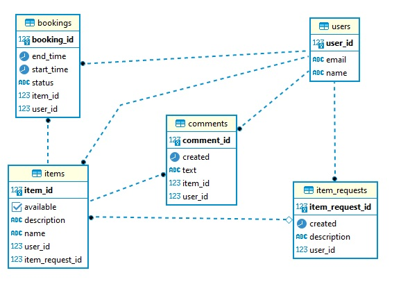

# Приложение ShareIt

Стек:
Java, Spring Boot, Postgres, Hibernate, Docker

Основная функциональность:

- создание пользователя, обновление, получение всех, по id, удаление
- создание предмета добавленного пользователем, обновление, получение по id, получение предметов пользователя,
  поиск по названию или описанию, создание комментария к предмету
- создание бронирования, обновление владельцем вещи, получение по id, получение бронирований пользователя или
  владельца вещи
- создание запроса вещи, получение запроса пользователя или других пользователей, получение по id

Схема базы данных:

